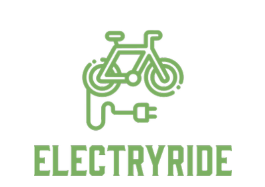

# ELECTRYRIDE

    

## Idea de negocio

La movilidad siempre ha sido un tema importante en las metropolis contemporaneas, el ajetreo de la ciudad nunca para en la cotidianidad de los días. Problemas como las grandes conglomeraciones,
el tráfico molesto, los sistemas de transporte público llegando a su límite día tras día, llevando a las personas a niveles de estress nunca antes alcanzados. Ante todo esto, muchos quisieran optar por 
otros medios de transporte amigables con el ambiente, pero entre los altos niveles de inseguridad y/o las grandes distancias se vuelve imposible desplazarnos hacia nuestros destinos de este modo.

Pero eso era antes, te presentamos a ELECTRYRIDE la aplicación que te permitirá alquilar una bicicleta electrica úbicada en diferentes puntos de la ciudad, una alternativa si no quieres usar un "uber" o algun
vehiculo conducido por otra persona. Amigable con el ambiente y bueno para tu salud. Una solución innovadora para uno de los problemas más tradicionales de las principales ciudades en el mundo.
adicionando el pago electronico como metodo de pago, facil al alcance de un click.

## Autores

|     Nombre    |     Rol         |
|:--------------:|:-------------: |
|Miguel  Sanchez|Team Developer |
|César González|Team Developer  |
|David Caycedo|Team Developer  |
|Eduard Jimenez|Team Developer  |

